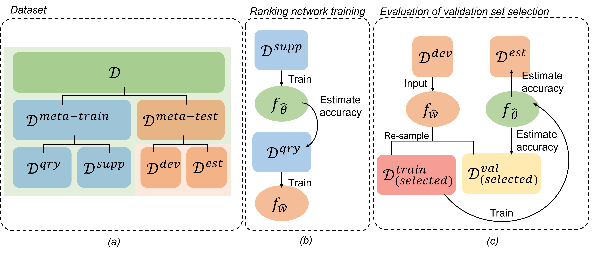

# Selecting performance-representative validation sets for developing medical image segmentation neural networks
Code accompanying the paper


The algorithm is based on continuous relaxation and gradient descent in the architecture space. It is able to efficiently design high-performance convolutional architectures for image classification (on CIFAR-10 and ImageNet) and recurrent architectures for language modeling (on Penn Treebank and WikiText-2). Only a single GPU is required.
<p align="center">
  
</p>
## Recommended Requirements
```
Python == 3.11.4, PyTorch == 2.0.1, monai == 1.2.0
```
NOTE: Other versions of Python and Pytorch may still compatible with this repo but not guaranteed.

## Datasets Download and Process
Instructions for acquiring PTB and WT2 can be found [here](https://zenodo.org/records/7013610#.ZQLTVXbMJhE). Download and unzip to the root dir. All data examples is cropped and store into a h5 file for quicker load time. In the jupyer notebook file data_preparation/pre_process_prostate.ipynb, simply call the function "convert_h5(original data dir, destination data dir)" with two input strings as described. One example's image and label will be processed and store into one file with unique index.
## Data dir txt file

Simply run and output a txt file with shuffled data dir name so that spilt of dataset remain consistent.

```
python data_preparation data_dir_shuffle.py
```


## Segmentation network training 
Train segmentation network from scratch, run
```
python train_seg_only.py cuda:0 4 your_seg_nick_name
```


## Ranking network training 
Train ranking network from scratch, run
```
python train_sel_only.py cuda:0 6 your_seg_nick_name
```

## Evaluation 
Simply run 

```
python post_hold_out_120
```

<p align="center">
  
</p>

## Citation
If you use any part of this code in your research, please cite our [paper](https://arxiv.org):
```
@article{XXX
}
```
